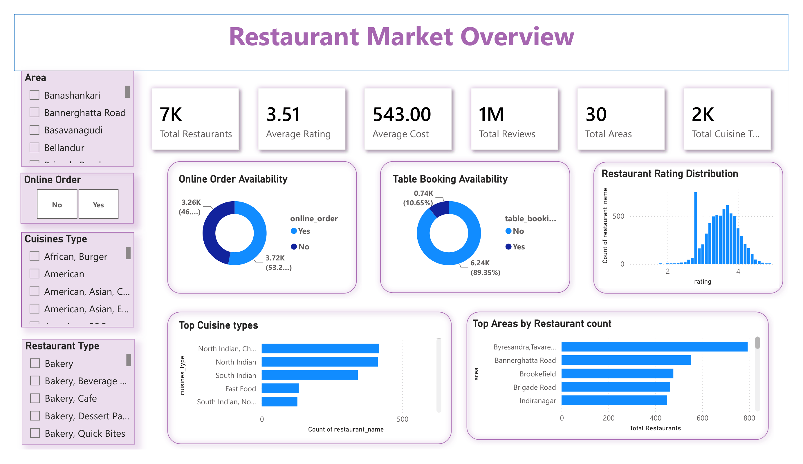
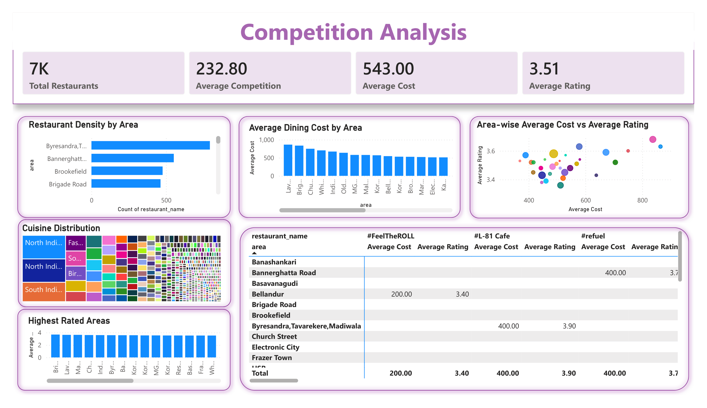
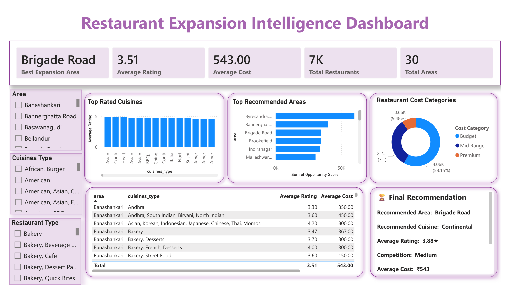

# Restaurant-expansion-intelligence
Business Intelligence solution for restaurant location planning using PostgreSQL, SQL, and Power BI. The project analyzes customer ratings, cuisine demand, competition, and pricing to identify high-potential expansion opportunities.

## Project Overview
Restaurant Expansion Intelligence is a Business Intelligence project developed using PostgreSQL and Power BI.
The objective is to identify the best location for a restaurant chain to open its next outlet by analyzing customer ratings, restaurant density, cuisine popularity, pricing, and customer engagement.

## Business Problem

Where should a restaurant chain open its next outlet?

This project identifies:

- High demand locations
- Competition levels
- Best performing cuisines
- Cost analysis
- Customer satisfaction
- Final business recommendation

## Tools Used

- PostgreSQL
- SQL
- Power BI
- Microsoft Excel

## Dataset

This project uses the **Zomato Restaurants Dataset**, a publicly available dataset from Kaggle for restaurant analytics and business intelligence.

**Dataset Source:**
🔗 https://www.kaggle.com/datasets/abhijitdahatonde/zomato-restaurants-dataset

### Dataset Features

* Restaurant Name
* Restaurant Type
* Cuisine Type
* Area
* Rating
* Number of Ratings
* Average Cost for Two
* Online Order
* Table Booking
* Local Address

The raw dataset was imported into PostgreSQL, where data cleaning, preprocessing, and exploratory data analysis were performed. A cleaned dataset (`zomato_clean.csv`) was generated and used for business analysis and Power BI dashboard development.

## SQL Workflow

1. Data Cleaning
2. Data Type Conversion
3. Exploratory Data Analysis
4. Business Analysis
5. Expansion Recommendation

## Dashboard 1

## Dashboard 2

## Dashboard 3

## Key Insights

- Budget restaurants dominate the market.
- Online ordering is widely available.
- Brigade Road shows high expansion potential.
- Continental cuisine has strong customer ratings.
- Moderate competition provides expansion opportunities.

## Final Recommendation

Open a mid-range Continental restaurant in Brigade Road.

Reason:

- High customer ratings
- Strong customer engagement
- Moderate competition
- Good average spending

## Acknowledgements

- Zomato Restaurants Dataset from Kaggle.
- Thanks to the dataset contributors for making the data publicly available for educational and research purposes.
